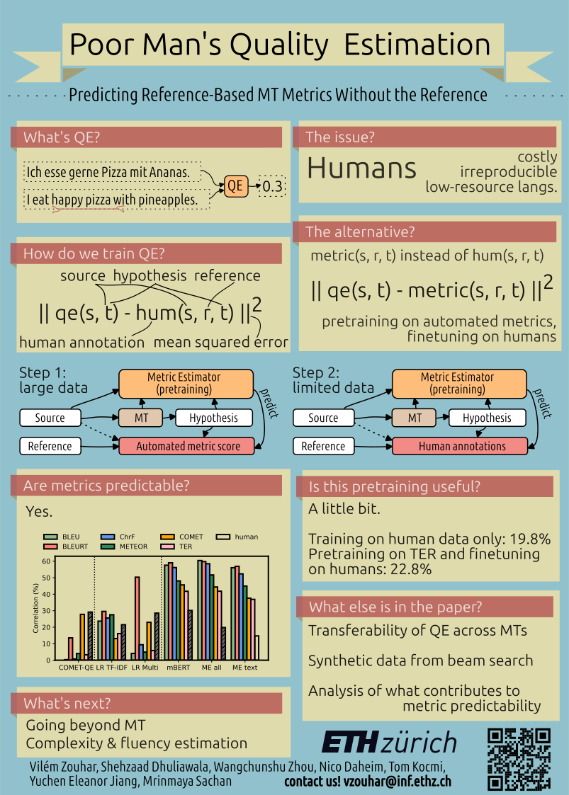

# Poor Man's Quality Estimation

[](https://aclanthology.org/2023.eacl-main.95.pdf)
&nbsp;
[](https://www.youtube.com/watch?v=feMWDVylhac)

Code for the paper [Poor Man's Quality Estimation: Predicting Reference-Based MT Metrics Without the Reference](https://aclanthology.org/2023.eacl-main.95.pdf) by Vilém Zouhar, Shehzaad Dhuliawala, Wangchunshu Zhou, Nico Daheim, Tom Kocmi, Yuchen Eleanor Jiang and Mrinmaya Sachan from ETH Zürich.

> Machine translation quality estimation (QE) predicts human judgements of a translation hypothesis without seeing the reference. State-of-the-art QE systems based on pretrained language models have been achieving remarkable correlations with human judgements yet they are computationally heavy and require human annotations, which are slow and expensive to create. To address these limitations, we define the problem of metric estimation (ME) where one predicts the automated metric scores also without the reference. We show that even without access to the reference, our model can estimate automated metrics (ρ=60% for BLEU, ρ=51% for other metrics) at the sentence-level. Because automated metrics correlate with human judgements, we can leverage the ME task for pre-training a QE model. For the QE task, we find that pre-training on TER is better (ρ=23%) than training for scratch (ρ=20%).

The paper was presented at EACL 2023.

```
@inproceedings{zouhar-etal-2023-poor,
    title = "Poor Man`s Quality Estimation: Predicting Reference-Based {MT} Metrics Without the Reference",
    author = "Zouhar, Vil{\'e}m  and
      Dhuliawala, Shehzaad  and
      Zhou, Wangchunshu  and
      Daheim, Nico  and
      Kocmi, Tom  and
      Jiang, Yuchen Eleanor  and
      Sachan, Mrinmaya",
    booktitle = "Proceedings of the 17th Conference of the European Chapter of the Association for Computational Linguistics",
    month = may,
    year = "2023",
    address = "Dubrovnik, Croatia",
    publisher = "Association for Computational Linguistics",
    url = "https://aclanthology.org/2023.eacl-main.95/",
    doi = "10.18653/v1/2023.eacl-main.95",
    pages = "1311--1325",
}
```

Code usage instructions WIP.


